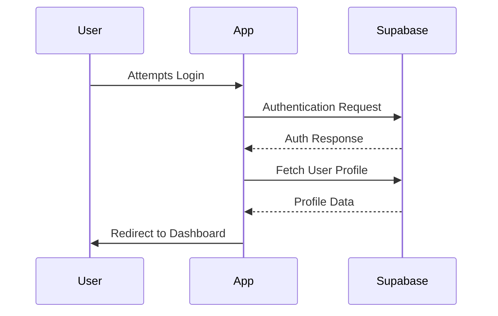
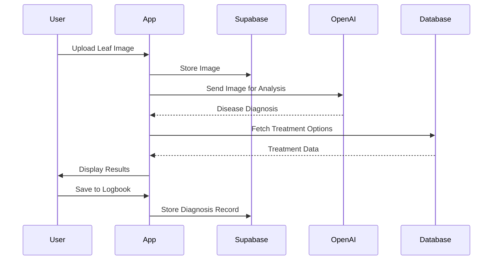
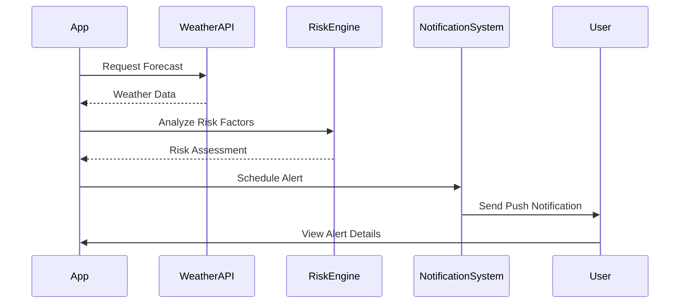

# Garden Buddy: Detailed Development Plan

## 🌱 Project Overview

Garden Buddy is an AI-powered smart farming assistant that helps vegetable and grape growers diagnose plant problems and stay ahead of pest/fungal threats. The app uses image recognition, weather data, and AI to provide timely advice and treatment recommendations.

## 🎯 Core Value Proposition

"Take a photo of a plant leaf → get instant diagnosis → receive organic & chemical treatment advice → get weather-based spray reminders to prevent future issues."

## 📊 Development Phases

### Phase 1: Core Infrastructure ✅ (CURRENT)

#### Authentication & User Management
- [x] Set up Next.js project with App Router
- [x] Configure Supabase for authentication and database
- [x] Implement email/password authentication
- [x] Add social login (Google, Facebook)
- [x] Create user dashboard
- [ ] Create profiles table in Supabase

#### Database Schema Implementation
- [ ] Users table
- [ ] Profiles table
- [ ] Diagnoses table
- [ ] Treatments table
- [ ] Weather_Alerts table
- [ ] Community_Votes table

#### UI Foundation
- [x] Set up React Native Web components
- [x] Implement responsive design with Tailwind CSS
- [x] Create navigation structure
- [x] Build authentication pages (login, register)
- [x] Design dashboard layout

### Phase 2: Disease Detection System 🔍 ✅ (COMPLETED)

#### Image Upload & Processing ✅
- [x] Implement camera access for mobile devices
- [x] Create image upload component with preview
- [x] Set up image storage in Supabase
- [x] Add image preprocessing for AI analysis

#### AI Integration ✅
- [x] Configure multiple AI providers (Claude AI, OpenAI GPT-4 Vision)
- [x] Develop prompt engineering for accurate diagnosis
- [x] Implement confidence scoring algorithm
- [x] Create fallback mechanisms with plant disease database
- [x] Add community voting system for low-confidence results

#### Treatment Recommendation Engine ✅
- [x] Build comprehensive treatment database (6 common diseases)
- [x] Develop AI prompts for treatment recommendations
- [x] Create UI for displaying organic vs. chemical options
- [x] Implement treatment saving functionality

#### Diagnosis Flow ✅
- [x] Design step-by-step diagnosis workflow
- [x] Create results page with detailed information
- [x] Implement save to logbook functionality
- [x] Add community sharing capabilities for diagnoses

#### 🚀 Phase 2.5: Enhanced ML Integration (NEW)
- [ ] Integrate TensorFlow.js for offline diagnosis
- [ ] Implement PlantVillage dataset models
- [ ] Add ml5.js for simplified browser-based ML
- [ ] Create hybrid online/offline diagnosis system

### Phase 3: Weather Integration & Alerts 🌦️

#### Weather API Integration
- [ ] Set up OpenWeatherMap API connection (Free: 60 calls/min)
- [ ] Implement WeatherAPI.com as backup (Free tier)
- [ ] Add Agromonitoring API for satellite data
- [ ] Create weather data processing functions
- [ ] Design weather display components

#### Risk Assessment Engine
- [ ] Develop algorithms for fungal disease risk based on humidity/rain
- [ ] Create pest infestation risk models based on temperature
- [ ] Implement crop-specific risk thresholds
- [ ] Build notification triggering system
- [ ] Add seasonal disease pattern recognition

#### Alert System
- [ ] Design alert UI components
- [ ] Create alert scheduling system with Supabase Edge Functions
- [ ] Implement Firebase Cloud Messaging (FCM) for push notifications
- [ ] Build alert management interface for users
- [ ] Add Trigger.dev integration for advanced automation

#### Spray Calendar & Tracking
- [ ] Design calendar interface for tracking sprays
- [ ] Implement spray scheduling algorithm
- [ ] Create reminder system for upcoming sprays
- [ ] Add manual spray logging functionality
- [ ] **NEW**: Spray resistance tracking to avoid overuse
- [ ] **NEW**: Weather-optimal spray timing recommendations

### Phase 4: Enhanced Crop Management 📝

#### Advanced Logbook Implementation
- [ ] Design Notion-style logbook interface with react-table
- [ ] Create data structure for storing diagnoses history
- [ ] Implement filtering and sorting capabilities
- [ ] Add notes and custom fields for entries
- [ ] **NEW**: GPS field tagging for location-based tracking
- [ ] **NEW**: Before/after treatment photo comparisons
- [ ] **NEW**: Export functionality for farm records

#### Enhanced Analytics Dashboard
- [ ] Design analytics components with Chart.js/D3.js
- [ ] Implement treatment outcome tracking
- [ ] **NEW**: Disease trend analytics by region
- [ ] **NEW**: Seasonal pattern recognition
- [ ] **NEW**: Success rate metrics for different treatments
- [ ] Create disease trend analysis
- [ ] Add seasonal patterns recognition

#### Export Functionality
- [ ] Create PDF report generation
- [ ] Implement CSV export for data analysis
- [ ] Add sharing options for reports
- [ ] Design printable spray schedules

### Phase 5: Community Features 👥 ✅ (PARTIALLY COMPLETED)

#### Community Feed ✅
- [x] Design community interface
- [x] Implement diagnosis sharing system
- [x] Create voting mechanism for community validation
- [ ] Add commenting system for discussions
- [ ] **NEW**: Expert verification system
- [ ] **NEW**: Regional disease alerts based on community reports

#### Enhanced User Profiles & Expertise
- [x] Create user profile system
- [ ] Implement expertise levels and badges
- [ ] Add following/follower functionality
- [ ] Create leaderboards for active contributors
- [ ] **NEW**: Multilingual voice advice system
- [ ] **NEW**: Expert mode toggle (beginner vs professional UI)

#### 🚀 Phase 5.5: Advanced Community Features (NEW)
- [ ] Community Q&A system (moderated or AI-supported)
- [ ] Success story sharing with before/after photos
- [ ] Local farming groups and regional discussions
- [ ] Integration with agricultural extension services

### Phase 6: AI Q&A System & Offline Capabilities 🤖

#### Enhanced Chat Interface
- [ ] Design chat UI components
- [ ] Implement real-time messaging
- [ ] Create conversation history storage
- [ ] Add typing indicators and message status
- [ ] **NEW**: Voice input/output for accessibility
- [ ] **NEW**: Multilingual support for global users

#### Advanced AI Integration
- [ ] Configure GPT-4 for agricultural Q&A
- [ ] Develop specialized prompts for farming advice
- [ ] Implement context awareness from user's diagnoses
- [ ] Create knowledge base integration
- [ ] **NEW**: Integration with CABI Plantwise Knowledge Bank
- [ ] **NEW**: Invasive Species Compendium integration

#### Offline Capabilities & PWA
- [ ] **NEW**: Implement Progressive Web App (PWA) features
- [ ] **NEW**: TensorFlow.js integration for offline diagnosis
- [ ] **NEW**: Cached treatment recommendations
- [ ] **NEW**: Offline-first data synchronization

### Phase 7: Refinement & Launch 🚀

#### Performance Optimization
- [ ] Conduct code audits
- [ ] Implement lazy loading and code splitting
- [ ] Optimize image processing
- [ ] Reduce API calls with caching

#### Comprehensive Testing
- [ ] Create automated test suite
- [ ] Conduct user acceptance testing
- [ ] Perform cross-browser compatibility testing
- [ ] Test on various mobile devices

#### User Feedback Implementation
- [ ] Create feedback collection system
- [ ] Analyze and prioritize feedback
- [ ] Implement high-priority changes
- [ ] Conduct follow-up testing

#### Launch Preparation
- [ ] Finalize documentation
- [ ] Create marketing materials
- [ ] Prepare app store listings
- [ ] Plan launch strategy

## 📚 Additional Resources

### GitHub Projects for Reference
- **Plant Disease Detector**: React + Flask + TensorFlow integration patterns
- **ML Plant Doctor**: MobileNet with TensorFlow.js implementation
- **React Farm Logbook**: Crop and weather logging system architecture
- **SmartAgro**: Agriculture web app UI/UX best practices
- **CropCare**: Django/React crop diagnosis and alert system

### Free Datasets & APIs
- **PlantVillage Dataset** (Kaggle): 87k+ labeled plant disease images
- **OpenWeatherMap**: Weather data with agricultural focus
- **CABI Knowledge Bank**: Professional treatment recommendations
- **HuggingFace**: Pre-trained vision models for plant recognition

### Development Tools
- **TensorFlow.js**: Browser-based ML for offline capabilities
- **Firebase FCM**: Free push notifications
- **Supabase Edge Functions**: Serverless backend automation
- **Trigger.dev**: Advanced workflow automation

## 🛠️ Technical Implementation Details

### Authentication Flow


### Disease Detection Flow


### Weather Alert Flow


## 📱 UI/UX Wireframes

### Key Screens to Implement

1. **Onboarding Flow**
   - Welcome screen
   - Location selection
   - Crop type selection
   - Notification preferences

2. **Disease Diagnosis Flow**
   - Camera/upload screen
   - Processing indicator
   - Results page with confidence score
   - Treatment options (tabbed view)

3. **Weather Dashboard**
   - Current conditions
   - Forecast cards
   - Risk indicators
   - Spray recommendations

4. **Logbook Interface**
   - Timeline view
   - Calendar view
   - Detailed entry view
   - Analytics dashboard

5. **Community Feed**
   - Post listing
   - Detailed post view
   - Voting interface
   - Comment section

## 🗄️ Database Schema Details

### Users Table
```sql
CREATE TABLE users (
  id UUID PRIMARY KEY DEFAULT gen_random_uuid(),
  email VARCHAR(255) UNIQUE NOT NULL,
  password_hash VARCHAR(255) NOT NULL,
  full_name VARCHAR(255),
  created_at TIMESTAMP DEFAULT NOW(),
  updated_at TIMESTAMP DEFAULT NOW()
);
```

### Profiles Table
```sql
CREATE TABLE profiles (
  id UUID PRIMARY KEY DEFAULT gen_random_uuid(),
  user_id UUID REFERENCES users(id) ON DELETE CASCADE,
  full_name VARCHAR(255),
  avatar_url VARCHAR(255),
  bio TEXT,
  expertise_level VARCHAR(255),
  updated_at TIMESTAMP DEFAULT NOW()
);
```

### Diagnoses Table
```sql
CREATE TABLE diagnoses (
  id UUID PRIMARY KEY DEFAULT gen_random_uuid(),
  user_id UUID REFERENCES users(id) ON DELETE CASCADE,
  image_url VARCHAR(255) NOT NULL,
  plant_type VARCHAR(255) NOT NULL,
  disease_name VARCHAR(255),
  confidence_score DECIMAL,
  ai_diagnosis JSONB,
  community_diagnosis JSONB,
  created_at TIMESTAMP DEFAULT NOW(),
  status VARCHAR(255) DEFAULT 'pending'
);
```

### Treatments Table
```sql
CREATE TABLE treatments (
  id UUID PRIMARY KEY DEFAULT gen_random_uuid(),
  diagnosis_id UUID REFERENCES diagnoses(id) ON DELETE CASCADE,
  treatment_type VARCHAR(255) NOT NULL,
  description TEXT NOT NULL,
  application_date TIMESTAMP,
  effectiveness_rating INTEGER
);
```

### Weather_Alerts Table
```sql
CREATE TABLE weather_alerts (
  id UUID PRIMARY KEY DEFAULT gen_random_uuid(),
  user_id UUID REFERENCES users(id) ON DELETE CASCADE,
  alert_type VARCHAR(255) NOT NULL,
  description TEXT NOT NULL,
  created_at TIMESTAMP DEFAULT NOW(),
  expires_at TIMESTAMP,
  status VARCHAR(255) DEFAULT 'active'
);
```

### Community_Votes Table
```sql
CREATE TABLE community_votes (
  id UUID PRIMARY KEY DEFAULT gen_random_uuid(),
  diagnosis_id UUID REFERENCES diagnoses(id) ON DELETE CASCADE,
  user_id UUID REFERENCES users(id) ON DELETE CASCADE,
  voted_disease VARCHAR(255) NOT NULL,
  created_at TIMESTAMP DEFAULT NOW()
);
```

## 🧠 AI Integration Strategy

### GPT-4 Vision Prompts

For disease detection:
```
You are an expert agricultural pathologist. Analyze this image of a plant leaf and:
1. Identify the most likely disease affecting this plant
2. Provide a confidence score (0-100%)
3. List the key visual symptoms you observed
4. Rate the severity (mild, moderate, severe)
5. Suggest if community review is needed for this diagnosis

Plant type: [PLANT_TYPE]
```

For treatment recommendations:
```
As an agricultural expert, provide treatment recommendations for [DISEASE_NAME] on [PLANT_TYPE]:

1. Organic treatment options (at least 3, ranked by effectiveness)
2. Chemical treatment options (at least 3, ranked by effectiveness)
3. Preventive measures to avoid recurrence
4. Application timing and frequency
5. Safety precautions for each treatment

Prefer treatments that are widely available and cost-effective for small-scale farmers.
```

## 📅 Implementation Timeline

### Month 1: Foundation
- Week 1-2: Complete authentication and user management
- Week 3-4: Implement database schema and basic UI components

### Month 2: Core Features
- Week 1-2: Build image upload and AI diagnosis system
- Week 3-4: Develop treatment recommendation engine

### Month 3: Weather & Alerts
- Week 1-2: Integrate weather API and risk assessment
- Week 3-4: Build notification system and spray calendar

### Month 4: Logbook & Community
- Week 1-2: Implement crop logbook and history tracking
- Week 3-4: Develop community features and voting system

### Month 5: Refinement & Launch
- Week 1-2: Add AI Q&A system and knowledge base
- Week 3-4: Conduct testing, gather feedback, and prepare for launch

## 🧪 Testing Strategy

### Unit Testing
- Component testing with Jest and React Testing Library
- API endpoint testing
- Database function testing
- AI prompt testing and validation
- **NEW**: ML model accuracy testing with PlantVillage dataset
- **NEW**: Offline functionality testing

### Integration Testing
- End-to-end user flows with Cypress
- API integration testing
- Database migration testing
- Third-party service integration testing
- **NEW**: Weather API integration testing
- **NEW**: Push notification delivery testing
- **NEW**: GPS and location services testing

### User Testing
- Beta testing with real farmers and gardeners
- Usability testing for mobile and desktop
- Accessibility testing (voice, multilingual)
- Performance testing under load
- **NEW**: Offline mode usability testing
- **NEW**: Voice interface testing
- **NEW**: Cross-platform PWA testing

### Success Metrics
- **User Engagement**: Daily active users, photos uploaded per user
- **Community Participation**: Voting rate, comment engagement
- **Diagnosis Accuracy**: AI confidence scores, community validation
- **Treatment Success**: User-reported outcome tracking

## 🚀 Launch Strategy

### Beta Testing
- Release to limited users
- Gather feedback and make improvements
- Fix critical issues

### Soft Launch
- Release to app stores with minimal marketing
- Monitor performance and user feedback
- Make necessary adjustments

### Full Launch
- Implement marketing campaign
- Reach out to agricultural communities
- Partner with agricultural extension services

## 🚀 Future Expansion Ideas

### 🎯 High-Impact Bonus Features (From Research)
- **📍 GPS Field Tagging**: Location-based crop tracking and revisit alerts
- **🗣️ Multilingual Voice Advice**: Audio recommendations in native languages
- **🌐 Offline Mode**: PWA with TensorFlow.js for low-connectivity areas
- **🧪 Spray Tracker**: Resistance prevention through application tracking
- **📊 Disease Trend Analytics**: Regional and seasonal pattern recognition
- **🤝 Expert Verification**: Professional validation of community diagnoses

### Advanced Technical Features
- **IoT Integration**: Connect with soil sensors, weather stations
- **Drone Integration**: Aerial crop monitoring and disease detection
- **Edge Computing**: On-device ML processing for instant results
- **Blockchain**: Immutable crop history and treatment records
- **AR/VR**: Augmented reality for in-field diagnosis guidance

### Business & Scaling
- **Marketplace**: Connect farmers with suppliers and buyers
- **Insurance Integration**: Crop loss documentation and claims
- **Precision Agriculture**: GPS-guided treatment recommendations
- **B2B Solutions**: Enterprise features for large farms
- **API Marketplace**: Third-party integrations and extensions

### Monetization Strategies
- **Premium AI Models**: Access to specialized, high-accuracy models
- **Professional Dashboard**: Advanced analytics and multi-field management
- **API Access**: Allow third-party integrations and white-labeling
- **Consultation Services**: Connect with agricultural experts
- **Hardware Partnerships**: Integrate with farming equipment and sensors

### Global Expansion
- **Localization**: Support for different crops and regional diseases
- **Language Support**: Multi-language interface with voice capabilities
- **Regional Partnerships**: Work with agricultural extension services
- **Offline-First Architecture**: Support for areas with limited internet
- **Mobile App**: Native iOS and Android with full feature parity
- **Government Integration**: Work with agricultural departments for data sharing

### Community Management
- Moderation of community content
- Expert verification program
- Regular engagement with power users
