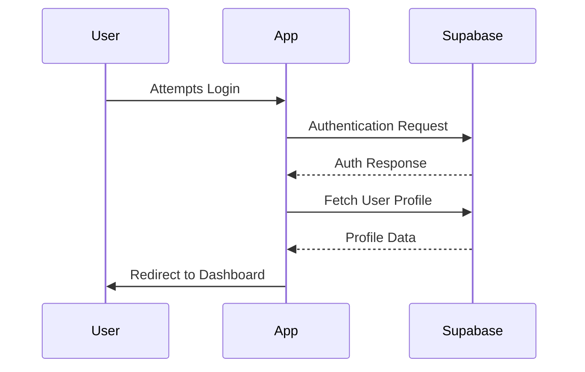
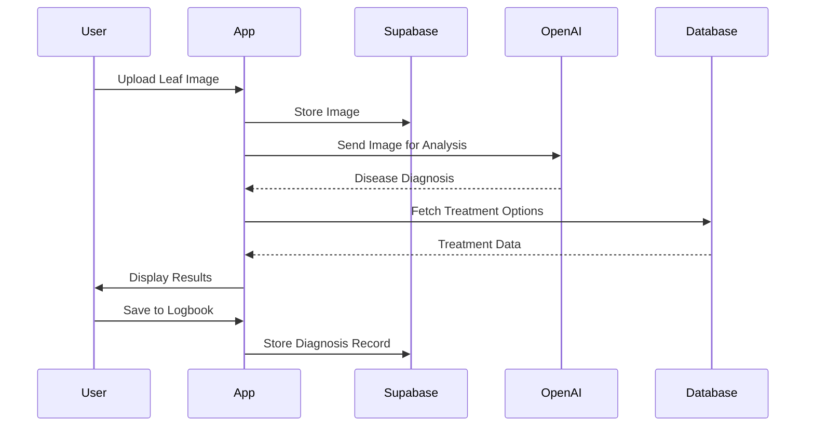
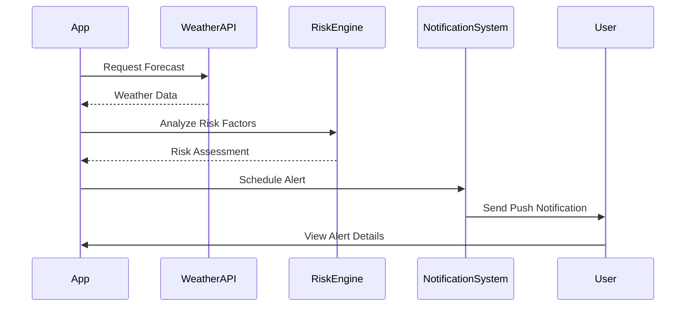

# Garden Buddy: Detailed Development Plan

## 🌱 Project Overview

Garden Buddy is an AI-powered smart farming assistant that helps vegetable and grape growers diagnose plant problems and stay ahead of pest/fungal threats. The app uses image recognition, weather data, and AI to provide timely advice and treatment recommendations.

## 🎯 Core Value Proposition

"Take a photo of a plant leaf → get instant diagnosis → receive organic & chemical treatment advice → get weather-based spray reminders to prevent future issues."

## 📊 Development Phases

### Phase 1: Core Infrastructure ✅ (CURRENT)

#### Authentication & User Management
- [x] Set up Next.js project with App Router
- [x] Configure Supabase for authentication and database
- [x] Implement email/password authentication
- [x] Add social login (Google, Facebook)
- [x] Create user dashboard
- [ ] Create profiles table in Supabase

#### Database Schema Implementation
- [ ] Users table
- [ ] Profiles table
- [ ] Diagnoses table
- [ ] Treatments table
- [ ] Weather_Alerts table
- [ ] Community_Votes table

#### UI Foundation
- [x] Set up React Native Web components
- [x] Implement responsive design with Tailwind CSS
- [x] Create navigation structure
- [x] Build authentication pages (login, register)
- [x] Design dashboard layout

### Phase 2: Disease Detection System 🔍

#### Image Upload & Processing
- [ ] Implement camera access for mobile devices
- [ ] Create image upload component with preview
- [ ] Set up image storage in Supabase
- [ ] Add image preprocessing for AI analysis

#### AI Integration
- [ ] Configure OpenAI GPT-4 Vision API
- [ ] Develop prompt engineering for accurate diagnosis
- [ ] Implement confidence scoring algorithm
- [ ] Create fallback mechanisms for low-confidence results

#### Treatment Recommendation Engine
- [ ] Build treatment database from CABI/Plantwise data
- [ ] Develop GPT-4 prompts for treatment recommendations
- [ ] Create UI for displaying organic vs. chemical options
- [ ] Implement treatment saving functionality

#### Diagnosis Flow
- [ ] Design step-by-step diagnosis workflow
- [ ] Create results page with detailed information
- [ ] Implement save to logbook functionality
- [ ] Add sharing capabilities for diagnoses

### Phase 3: Weather Integration & Alerts 🌦️

#### Weather API Integration
- [ ] Set up OpenWeatherMap API connection
- [ ] Implement location-based weather fetching
- [ ] Create weather data processing functions
- [ ] Design weather display components

#### Risk Assessment Engine
- [ ] Develop algorithms for fungal disease risk based on humidity/rain
- [ ] Create pest infestation risk models based on temperature
- [ ] Implement crop-specific risk thresholds
- [ ] Build notification triggering system

#### Alert System
- [ ] Design alert UI components
- [ ] Create alert scheduling system
- [ ] Implement push notification system
- [ ] Build alert management interface for users

#### Spray Calendar
- [ ] Design calendar interface for tracking sprays
- [ ] Implement spray scheduling algorithm
- [ ] Create reminder system for upcoming sprays
- [ ] Add manual spray logging functionality

### Phase 4: Crop Logbook & History 📝

#### Logbook Implementation
- [ ] Design logbook interface
- [ ] Create data structure for storing diagnoses history
- [ ] Implement filtering and sorting capabilities
- [ ] Add notes and custom fields for entries

#### Analytics Dashboard
- [ ] Design analytics components
- [ ] Implement data visualization with Chart.js
- [ ] Create disease trend analysis
- [ ] Add seasonal patterns recognition

#### Export Functionality
- [ ] Create PDF report generation
- [ ] Implement CSV export for data analysis
- [ ] Add sharing options for reports
- [ ] Design printable spray schedules

### Phase 5: Community Features 👥

#### Community Feed
- [ ] Design community interface
- [ ] Implement post creation for diagnoses
- [ ] Create commenting system
- [ ] Add moderation tools

#### Voting System
- [ ] Design voting UI
- [ ] Implement upvote/downvote functionality
- [ ] Create reputation system
- [ ] Build consensus algorithm for community diagnoses

#### User Profiles
- [ ] Enhance user profiles with community features
- [ ] Add badges and achievements
- [ ] Implement following/followers functionality
- [ ] Create expert verification system

### Phase 6: AI Q&A System 💬

#### Chat Interface
- [ ] Design conversational UI
- [ ] Implement message threading
- [ ] Create typing indicators and loading states
- [ ] Add image attachment in conversations

#### AI Integration
- [ ] Configure GPT-4 for agricultural knowledge
- [ ] Implement prompt chaining for complex questions
- [ ] Create context management for conversations
- [ ] Add feedback mechanism for answers

#### Knowledge Base
- [ ] Compile agricultural knowledge database
- [ ] Implement search functionality
- [ ] Create categorized browsing
- [ ] Add saving favorite answers

### Phase 7: Refinement & Launch 🚀

#### Performance Optimization
- [ ] Conduct code audits
- [ ] Implement lazy loading and code splitting
- [ ] Optimize image processing
- [ ] Reduce API calls with caching

#### Comprehensive Testing
- [ ] Create automated test suite
- [ ] Conduct user acceptance testing
- [ ] Perform cross-browser compatibility testing
- [ ] Test on various mobile devices

#### User Feedback Implementation
- [ ] Create feedback collection system
- [ ] Analyze and prioritize feedback
- [ ] Implement high-priority changes
- [ ] Conduct follow-up testing

#### Launch Preparation
- [ ] Finalize documentation
- [ ] Create marketing materials
- [ ] Prepare app store listings
- [ ] Plan launch strategy

## 🛠️ Technical Implementation Details

### Authentication Flow


### Disease Detection Flow


### Weather Alert Flow


## 📱 UI/UX Wireframes

### Key Screens to Implement

1. **Onboarding Flow**
   - Welcome screen
   - Location selection
   - Crop type selection
   - Notification preferences

2. **Disease Diagnosis Flow**
   - Camera/upload screen
   - Processing indicator
   - Results page with confidence score
   - Treatment options (tabbed view)

3. **Weather Dashboard**
   - Current conditions
   - Forecast cards
   - Risk indicators
   - Spray recommendations

4. **Logbook Interface**
   - Timeline view
   - Calendar view
   - Detailed entry view
   - Analytics dashboard

5. **Community Feed**
   - Post listing
   - Detailed post view
   - Voting interface
   - Comment section

## 🗄️ Database Schema Details

### Users Table
```sql
CREATE TABLE users (
  id UUID PRIMARY KEY REFERENCES auth.users(id) ON DELETE CASCADE,
  email TEXT UNIQUE NOT NULL,
  created_at TIMESTAMP WITH TIME ZONE DEFAULT NOW(),
  last_login TIMESTAMP WITH TIME ZONE,
  location JSONB,
  preferred_crops TEXT[],
  notification_preferences JSONB
);
```

### Profiles Table
```sql
CREATE TABLE profiles (
  id UUID PRIMARY KEY REFERENCES auth.users(id) ON DELETE CASCADE,
  full_name TEXT,
  avatar_url TEXT,
  bio TEXT,
  expertise_level TEXT,
  updated_at TIMESTAMP WITH TIME ZONE DEFAULT NOW()
);
```

### Diagnoses Table
```sql
CREATE TABLE diagnoses (
  id UUID PRIMARY KEY DEFAULT uuid_generate_v4(),
  user_id UUID REFERENCES users(id) ON DELETE CASCADE,
  image_url TEXT NOT NULL,
  plant_type TEXT NOT NULL,
  disease_name TEXT,
  confidence_score DECIMAL,
  ai_diagnosis JSONB,
  community_diagnosis JSONB,
  created_at TIMESTAMP WITH TIME ZONE DEFAULT NOW(),
  status TEXT DEFAULT 'pending'
);
```

### Treatments Table
```sql
CREATE TABLE treatments (
  id UUID PRIMARY KEY DEFAULT uuid_generate_v4(),
  diagnosis_id UUID REFERENCES diagnoses(id) ON DELETE CASCADE,
  treatment_type TEXT NOT NULL,
  description TEXT NOT NULL,
  application_date TIMESTAMP WITH TIME ZONE,
  effectiveness_rating INTEGER
);
```

### Weather_Alerts Table
```sql
CREATE TABLE weather_alerts (
  id UUID PRIMARY KEY DEFAULT uuid_generate_v4(),
  user_id UUID REFERENCES users(id) ON DELETE CASCADE,
  alert_type TEXT NOT NULL,
  description TEXT NOT NULL,
  created_at TIMESTAMP WITH TIME ZONE DEFAULT NOW(),
  expires_at TIMESTAMP WITH TIME ZONE,
  status TEXT DEFAULT 'active'
);
```

### Community_Votes Table
```sql
CREATE TABLE community_votes (
  id UUID PRIMARY KEY DEFAULT uuid_generate_v4(),
  diagnosis_id UUID REFERENCES diagnoses(id) ON DELETE CASCADE,
  user_id UUID REFERENCES users(id) ON DELETE CASCADE,
  voted_disease TEXT NOT NULL,
  created_at TIMESTAMP WITH TIME ZONE DEFAULT NOW()
);
```

## 🧠 AI Integration Strategy

### GPT-4 Vision Prompts

For disease detection:
```
You are an expert agricultural pathologist. Analyze this image of a plant leaf and:
1. Identify the most likely disease affecting this plant
2. Provide a confidence score (0-100%)
3. List the key visual symptoms you observed
4. Rate the severity (mild, moderate, severe)
5. Suggest if community review is needed for this diagnosis

Plant type: [PLANT_TYPE]
```

For treatment recommendations:
```
As an agricultural expert, provide treatment recommendations for [DISEASE_NAME] on [PLANT_TYPE]:

1. Organic treatment options (at least 3, ranked by effectiveness)
2. Chemical treatment options (at least 3, ranked by effectiveness)
3. Preventive measures to avoid recurrence
4. Application timing and frequency
5. Safety precautions for each treatment

Prefer treatments that are widely available and cost-effective for small-scale farmers.
```

## 📅 Implementation Timeline

### Month 1: Foundation
- Week 1-2: Complete authentication and user management
- Week 3-4: Implement database schema and basic UI components

### Month 2: Core Features
- Week 1-2: Build image upload and AI diagnosis system
- Week 3-4: Develop treatment recommendation engine

### Month 3: Weather & Alerts
- Week 1-2: Integrate weather API and risk assessment
- Week 3-4: Build notification system and spray calendar

### Month 4: Logbook & Community
- Week 1-2: Implement crop logbook and history tracking
- Week 3-4: Develop community features and voting system

### Month 5: Refinement & Launch
- Week 1-2: Add AI Q&A system and knowledge base
- Week 3-4: Conduct testing, gather feedback, and prepare for launch

## 🧪 Testing Strategy

### Unit Testing
- Test individual components and functions
- Ensure API integrations work correctly
- Validate data processing functions

### Integration Testing
- Test authentication flow
- Verify image upload and processing
- Validate weather data integration

### User Acceptance Testing
- Test with a small group of farmers
- Gather feedback on UI/UX
- Validate diagnosis accuracy

### Performance Testing
- Test app performance on various devices
- Measure API response times
- Optimize image processing

## 🚀 Launch Strategy

### Beta Testing
- Release to limited users
- Gather feedback and make improvements
- Fix critical issues

### Soft Launch
- Release to app stores with minimal marketing
- Monitor performance and user feedback
- Make necessary adjustments

### Full Launch
- Implement marketing campaign
- Reach out to agricultural communities
- Partner with agricultural extension services

## 📈 Future Expansion Ideas

### Advanced Features
- Soil analysis integration
- Drone imagery support
- IoT sensor integration for automated monitoring
- Machine learning model that improves with community feedback

### Business Model Options
- Freemium model with basic features free, advanced features paid
- Subscription for premium features and unlimited diagnoses
- Partnership with agricultural input suppliers
- White-label solution for agricultural extension services

## 🔄 Maintenance Plan

### Regular Updates
- Bi-weekly bug fixes
- Monthly feature updates
- Quarterly major releases

### Data Management
- Regular database backups
- User data privacy compliance
- Performance monitoring and optimization

### Community Management
- Moderation of community content
- Expert verification program
- Regular engagement with power users
